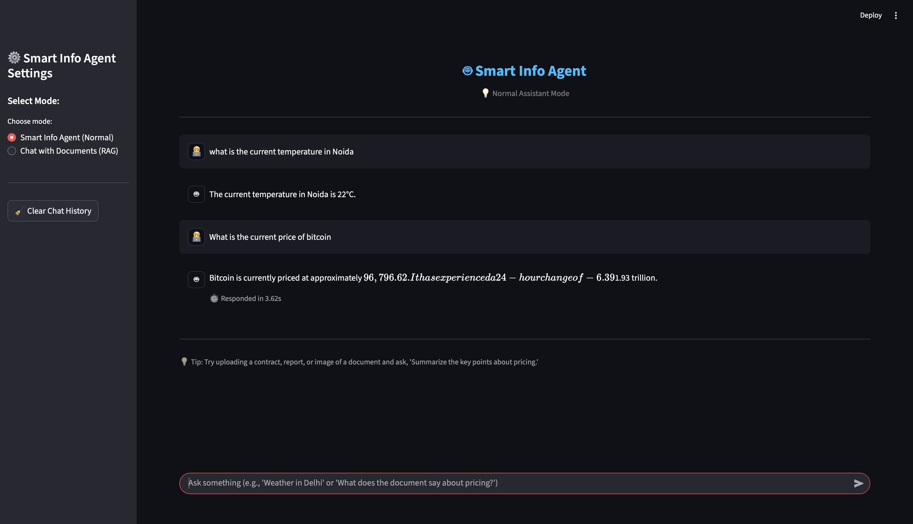
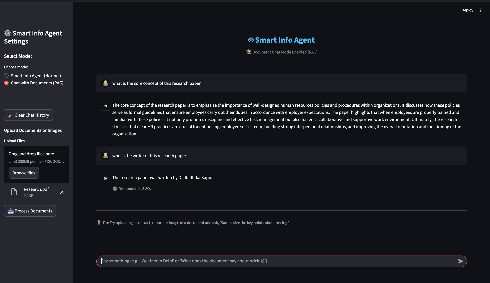

# 🤖 Smart Info Agent — AI + RAG Powered Intelligent Assistant

## 📘 Overview

**Smart Info Agent** is a fully modular, production-style **AI agent system** built using:

- **LangGraph** for agent workflow orchestration  
- **Azure OpenAI** for reasoning, tool-calling, and summarization  
- **Chroma Cloud + AzureOpenAI Embeddings** for powerful document RAG  
- **Streamlit** for an interactive, modern chat UI  
- **Deep OCR-based document parsing** (PDF/DOCX/Image/TXT)

This system is designed as a **real-world, multi-capability AI assistant**, capable of:

- Calling external tools/APIs automatically  
- Running RAG queries on uploaded documents  
- Extracting text from PDFs, scanned images, and DOCX using OCR  
- Maintaining conversational context  
- Generating clear, human-friendly responses  

Perfect for **learning**, **experimentation**, **student projects**, and building **production-ready AI systems**.

---

## 🖼️ Screenshots

Below are a few screenshots demonstrating the Smart Info Agent in action:



---




# 🚀 Key Features

## 🔮 1. Dual Mode AI System
### **A. Smart Info Agent (Normal Mode)**
Uses **Azure GPT model + Tools** to answer real-time queries.

### **B. Chat with Documents (RAG Mode)**
Upload PDF, DOCX, TXT, JPG, PNG → system extracts + chunks + embeds + retrieves information using:

- OCR (Tesseract + PyMuPDF)
- Text chunking with overlap
- AzureOpenAI embeddings
- Chroma Cloud vector database

Ask questions directly about your documents:
> “Summarize page 3”  
> “What does this contract say about pricing?”  
> “Extract key points from the scanned invoice.”

---

## 🔧 2. Modular LangGraph Architecture

The agent is built using a **multi-node LangGraph workflow**:

### 🧩 Nodes
- **LLM Node** → Decides what to do (tool call / answer)  
- **Tool Execution Node** → Runs weather/crypto/phone/flight APIs  
- **Decision Node** → Determines if another tool call is required  
- **Memory Store** → Minimal conversation logging  

Each step is independent, debuggable, and scalable.

---

## 🔌 3. Real-Time Tool Integrations

| Domain | Tool Function | Example Query |
|--------|----------------|----------------|
| 🌤 Weather | `get_weather_info()` | “Weather in Delhi” |
| 💱 Crypto | `get_crypto_price()` | “BTC price today” |
| ✈️ Flights | `search_flights_amadeus()` | “Flights from Delhi to Mumbai” |
| 📞 Phone Verification | `verify_phone_number()` | “Verify +9196xxxxxx” |

The LLM automatically calls these tools when needed.

---

## 📝 4. Advanced Document Parsing + OCR

### Supports:
- **PDF**
- **DOCX**
- **TXT**
- **Images (jpg, jpeg, png)**

### Smart Parsing Includes:
- PyPDF2 + PyMuPDF hybrid extraction  
- Auto OCR when text is missing  
- Auto skip blank/unreadable pages  
- Parallel OCR for image-heavy PDFs  
- Safety timeouts  
- Chunking with overlap for high-quality retrieval  

---

## 📚 5. Robust RAG Pipeline

### RAG Flow:
1. Parse files (PDF/DOCX/IMG/TXT)
2. Extract text (with OCR fallback)
3. Chunk text (configurable size & overlap)
4. Embed using AzureOpenAI embedding model
5. Store chunks in **Chroma Cloud**
6. Retrieve top-k relevant chunks
7. Inject them into the query as context
8. Agent answers intelligently

The retrieval is highly accurate thanks to:
- Clean chunking
- Metadata storage
- Sentence-transformers embeddings
- Chroma’s scalable vector storage

---

## 🧠 6. Azure OpenAI Powered Agent

The LLM:
- Recognizes user intent  
- Decides if a tool is needed  
- Uses bound tools automatically  
- Summarizes structured tool results  
- Reads RAG context and gives precise answers  
- Responds in a friendly, concise tone  

---

## 💬 7. Interactive Streamlit Web UI

### UI Capabilities:
- Clean chat layout  
- Normal mode / RAG mode toggle  
- Multi-file upload sidebar  
- Real-time indexing progress  
- Chat history persistence  
- Clicking “Clear History” resets everything  
- Displays LLM response time  

---

# 🧩 Tech Stack

| Category | Technology | Purpose |
|----------|------------|----------|
| **LLM** | Azure OpenAI GPT | Reasoning & tool-calling |
| **Framework** | LangChain | Prompting & tool binding |
| **Workflow Engine** | LangGraph | Multi-node agent orchestration |
| **Vector DB** | Chroma Cloud | Store + retrieve document chunks |
| **Embeddings** | AzureOpenAI | Semantic search |
| **OCR** | Tesseract, PyMuPDF | PDF/image text extraction |
| **UI** | Streamlit | Chat interface |
| **Monitoring** | LangSmith | LLM call tracing |

---

# 📁 Folder Structure


---

## 🧱 Folder Structure

| Folder/File | Description |
|-------------|-------------|
| **config/** | Contains `settings.py` with all environment variables, API keys, Azure OpenAI setup, Chroma Cloud credentials and configuration constants. |
| **core/** | Core logic of the system including LangGraph agent workflow, RAG pipeline, memory management, and advanced document parsing. |
| **core/graph_builder.py** | Implements the **SmartInfoAgent** built using LangGraph. Handles LLM node, tool node, decision node, memory store, and RAG integration. |
| **core/rag.py** | Complete RAG pipeline: document parsing (PDF/DOCX/IMG/TXT), OCR extraction, chunking, embeddings, Chroma Cloud indexing, and retriever generation. |
| **core/utils.py** | Advanced text extraction utilities including PDF parsing, DOCX parsing, OCR (Tesseract + PyMuPDF), parallel OCR execution, and chunking logic. |
| **core/memory_store.py** | Lightweight message history manager for storing user queries, responses, and timestamps. |
| **tools/** | Contains LangGraph-compatible tool functions integrated with the agent. |
| **tools/weather_tool.py** | Tool for fetching weather information using external API. |
| **tools/crypto_tool.py** | Tool for fetching live crypto prices. |
| **tools/numverify_tool.py** | Tool for validating phone numbers. |
| **tools/amadeus_tool.py** | Tool for searching flights using Amadeus API. |
| **app.py** | The complete **Streamlit Web UI** implementation supporting both Normal mode and RAG mode. Handles file uploads, document indexing, chat interface, and response rendering. |
| **README.md** | Project documentation (this file). |

---

## ⚙️ Workflow Overview

### 🔁 **System Pipeline**

1. **User Input** →  
   Entered through Streamlit chat input (Normal mode or RAG mode).

2. **LLM Node (LangGraph)** →  
   Azure OpenAI model interprets the query, determines intent, and decides whether a tool call or direct response is needed.  
   Also injects RAG context if enabled.

3. **Tool Node Execution** →  
   Executes the tool corresponding to user intent:  
   - Weather  
   - Crypto  
   - Phone validation  
   - Flight search  
   Receives structured tool output.

4. **Decision Node** →  
   LangGraph checks whether the LLM needs to:
   - Make additional tool calls  
   - Or finalize the response

5. **Final LLM Response** →  
   The agent summarizes tool output or RAG-retrieved content into human-friendly language.

6. **Memory Store Update** →  
   Query and response stored using lightweight in-memory storage.

7. **UI Display (Streamlit)** →  
   Chat bubbles render user and assistant messages  
   + Response time  
   + Session history  
   + Reset option  

---

### 🔄 **Additional RAG Workflow (Document Chat Mode)**

1. **File Upload** → PDF/DOCX/TXT/Images  
2. **Document Parsing** →  
   - PDF text extraction  
   - OCR fallback for scanned PDFs & images  
   - DOCX parsing  
   - TXT handling  

3. **Chunking** →  
   Text split into overlapping chunks (configurable).  

4. **Embedding Generation** →  
   Uses AzureOpenAI model for vectorization.  

5. **Chroma Cloud Indexing** →  
   Chunks + metadata → stored in vector database.  

6. **Retriever Creation** →  
   Relevant chunks fetched via similarity search.  

7. **RAG-Augmented Prompting** →  
   Context inserted before user query → sent to LLM.  

8. **Final Answer** →  
   Accurate, context-aware, document-specific response.


---

## 💻 Usage Instructions

### ▶️ CLI Mode

Run the interactive command-line interface:
```bash
python main.py
```
#### Commands:
- **exit, quit, q** → End session
- **history, logs** → Show chat history
- **clear, reset** → Clear memory

---

## 🌐 Streamlit Web App
Launch the web-based chat interface:
```bash
streamlit run app.py
```

Then open the local URL (usually http://localhost:8501) in your browser.

#### ✨ Features:
- Enter queries in the chat input field  
- View responses in clean, formatted chat bubbles  
- Clear chat history instantly with a single click  
- Observe real-time response generation timing  
- Switch between **Normal Mode** and **RAG Mode**  
- Upload and index PDFs, DOCX, images, and text files  
- Chat directly with your uploaded documents  
- Automatic OCR for scanned PDFs and images  
- Persistent session-based message history  

---

## 🧠 Learnings & Takeaways
- Designing **context-aware AI agents** with clear decision flows  
- Building modular, node-based workflows using **LangGraph**  
- Implementing **tool-based architectures** with Azure OpenAI  
- Integrating multiple external APIs efficiently  
- Developing a complete **RAG pipeline** with Chroma Cloud & AzureOpenAI embeddings  
- Applying OCR pipelines for real-world scanned documents  
- Managing conversational memory for improved UX  
- Creating interactive, production-style LLM interfaces using **Streamlit**  
- Structuring AI projects for **scalability, readability, and maintainability**  

---

## 🧩 Extending the Agent
To add a new capability:
- Create a new tool function inside tools/ (e.g., tools/news_tool.py).
- Add it to the tools list in core/graph_builder.py.
- Update the system prompt with its usage rule.
- Optionally, extend the Streamlit UI for specialized display.

---

## 🤝 Contributions
Feel free to contribute! Here’s how you can help improve Smart Info Agent:
- Fork the repository and create your own branch.
- Commit your changes with clear, descriptive messages.
- Test your updates thoroughly (both CLI and Streamlit modes).
- Submit a Pull Request explaining what feature or fix you added.


